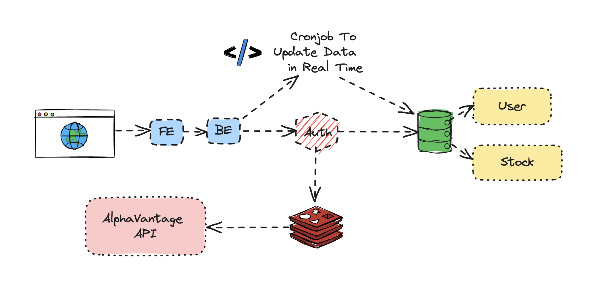
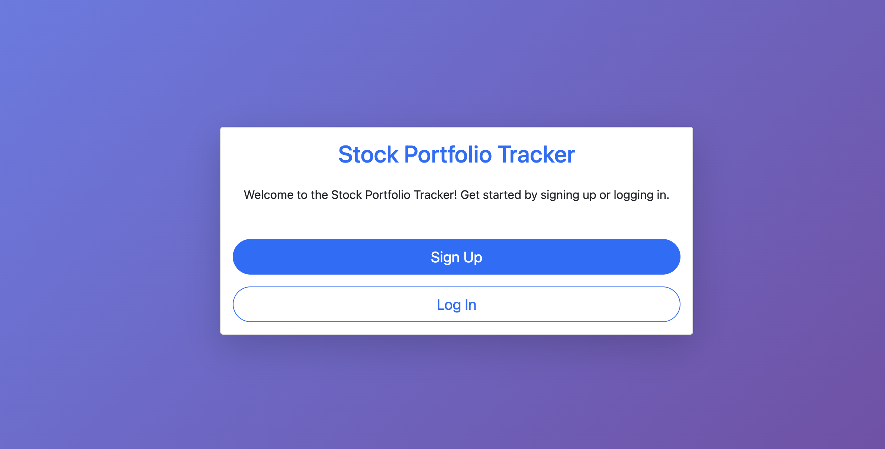
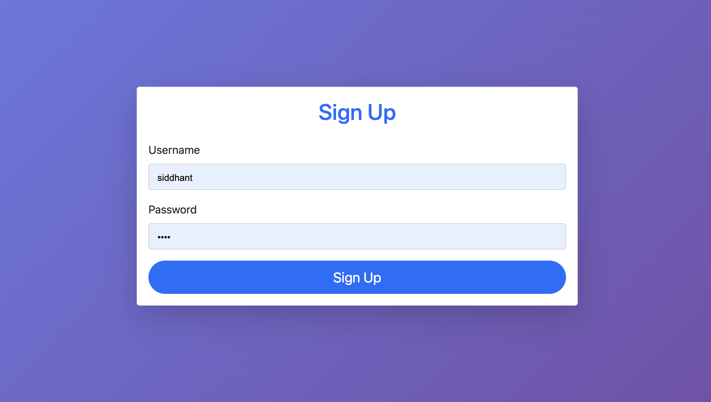
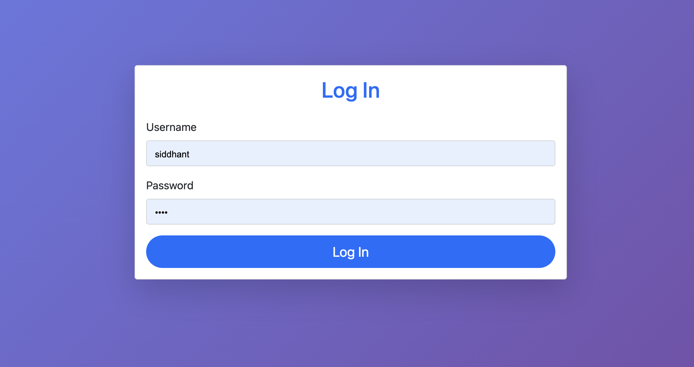
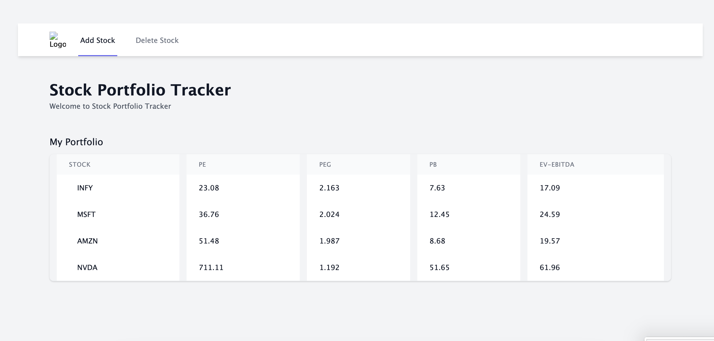
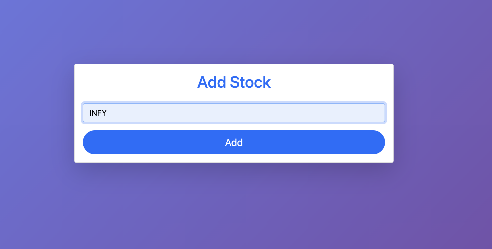
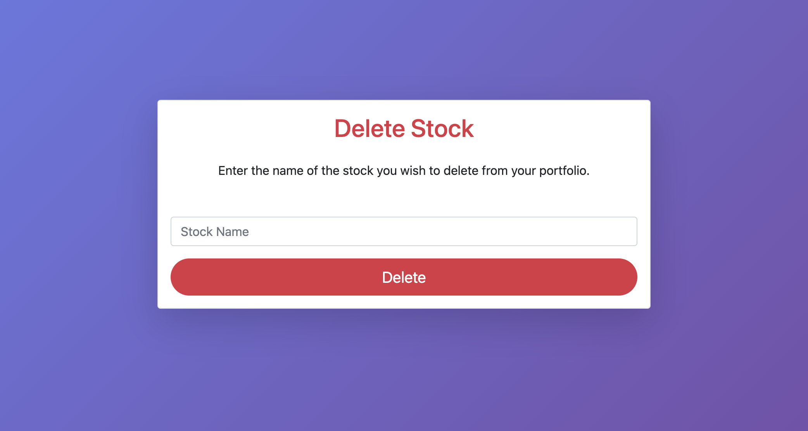

# Stock Portfolio Tracker

## Overview

The Stock Portfolio Tracker is a powerful and user-friendly application designed to help users manage their stock investments efficiently. It leverages modern web technologies, including MongoDB, Redis, and Node.js, to provide a robust and scalable solution for tracking stock portfolios.

## Gallery

## Features

- **User Authentication:** Secure user authentication using bcrypt.
- **Stock Management:** Add, view, and delete stocks from your portfolio.
- **Caching:** Fast data retrieval with Redis caching.
- **Database:** MongoDB for storing user and stock information.
- **Automated Updates:** Scheduled cron jobs to keep stock data up-to-date.
- **Responsive Design:** Beautiful and responsive UI with Bootstrap.

## Getting Started

### Prerequisites

Ensure you have the following installed on your machine:

- Node.js
- MongoDB (running on port 27017)
- Redis (running on port 6379)

### Installation
git clone https://github.com/siddhantchimankar/stock-portfolio-tracker.git
cd stock-portfolio-tracker
npm install
mongod
redis-server
node app

## Usage
Open your browser and navigate to http://localhost:3000.
Register a new account or log in with your existing credentials.
Start managing your stock portfolio!

## Contributing
We welcome contributions from the community. If you'd like to contribute, please fork the repository and create a pull request. Ensure your code follows the project's coding standards and includes relevant tests.

## License
This project is licensed under the MIT License - see the LICENSE file for details.

